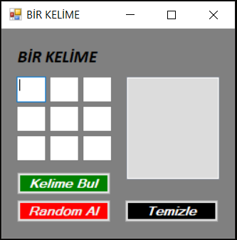

# CSharp-Form---Bir-Kelime-Bir-Islem---Kelime-Kismi

  
Çoğumuzun bildiği bir kelime bir işlem oyununun kelime kısmı olarak düşünülebilir. Bu uygulama kullanıcının girdiği veya random olarak alınanan dokuz harfi kullanarak türetilebilecek tüm Türkçe kelimeleri bulmaktadır.

<ul>
  <li>Kullanıcı Tarafından Harflerin Elle Girilmesi</li>  
</ul>  

<ul>
  <li>Uygulama Tarafında Harflerin Random Olarak Verilmesi</li>  
</ul>  

